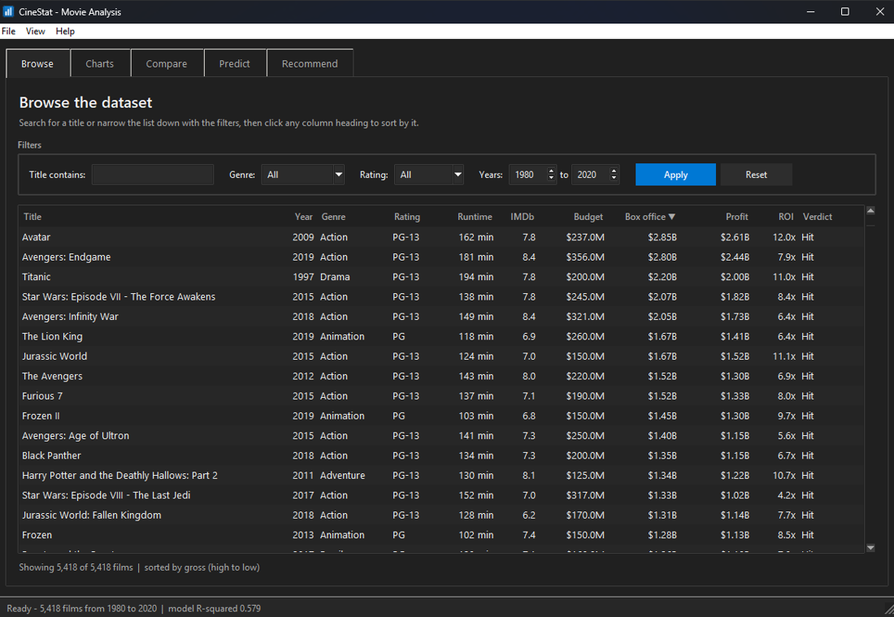
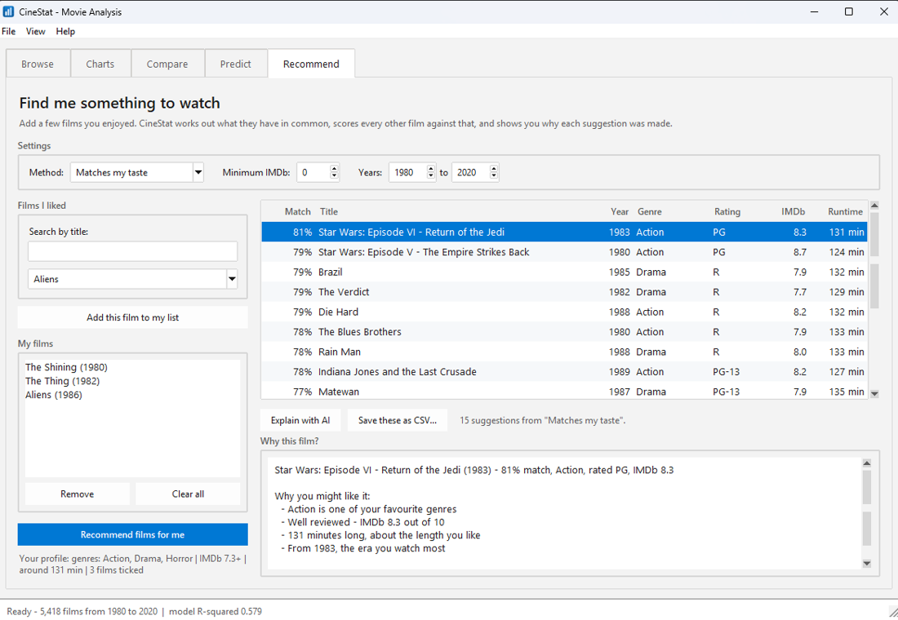

# CineStat — Movie Analysis *(Windows edition)*

**DS 1116 — Object Oriented Programming for Data Science Laboratory**
United International University · B.Sc. in Data Science

> **This is the `windows` branch.** The analysis is identical to `main`; the
> *window* is not. CineStat was written on a Mac, where Tkinter borrows the
> system's own widgets. On Windows it does not, so this branch adds a proper
> Windows interface: dark mode that follows Windows 11, crisp text on a
> high-DPI laptop, Segoe UI, Ctrl shortcuts, an app icon and a double-click
> launcher. See **[The Windows edition](#the-windows-edition)**.

Analysing 40 years of film data to answer two questions: **what makes a movie make money**,
and **what should I watch next?**

> Working on this project? Read **[PROJECT.md](PROJECT.md)** first — it records the
> decisions and why they were made, the rules new code must follow, and the feature backlog.

The project comes in two halves that share the same code:

| Part | What it is | How to run it |
|------|-----------|---------------|
| **Part 1** | A Jupyter notebook exploring the dataset | `jupyter notebook notebooks/01_movie_analysis.ipynb` |
| **Part 2** | A Tkinter desktop app doing the same thing by clicking | `python main.py` |

The notebook and the app both `import` the classes in `cinestat/`. The analysis is
written **once** and used **twice** — nothing is copied and pasted between them.

---

## Getting started

**Windows — the short way.** Double-click **`setup.bat`** once, then
**`run.bat`** whenever you want the program.

`setup.bat` builds a virtual environment in `.venv`, installs the packages,
checks that Tkinter is present, and runs the tests. `run.bat` starts the app —
and, unlike a bare double-click on a `.py` file, holds the window open if
anything goes wrong so the error can actually be read.

**Windows — from a terminal:**

```bat
py -m pip install -r requirements.txt   :: pandas, numpy, matplotlib, seaborn, scikit-learn, requests
py main.py                              :: launches the app
py -m unittest discover tests           :: runs all 291 tests
```

`py` is the launcher the official python.org installer puts on the PATH. If
Python came from somewhere else, `python` works just as well.

<details>
<summary>macOS and Linux</summary>

```bash
pip install -r requirements.txt
python3 main.py
python3 -m unittest discover tests
```

Everything below works the same. The Windows-only code in
`cinestat/gui/platform_ui.py` checks `sys.platform` first and quietly does
nothing off Windows.
</details>

The dataset is already in `data/movies.csv`, so nothing needs downloading, and no
internet connection is needed for anything.

> **If Python is not installed:** get it from
> <https://www.python.org/downloads/windows/> and tick **"Add python.exe to
> PATH"** on the first page of the installer. Leave **"tcl/tk and IDLE"**
> ticked as well — that is Tkinter, and the program is nothing but Tkinter
> without it.

**Optional:** the Recommend tab can have its explanations rewritten by an AI. That is the
only part that uses the internet, it is switched off until you add a key, and the tab works
fully without it. See [Explaining with AI](#explaining-with-ai).

---

## The dataset

**Movie Industry** — 7,668 films released between 1980 and 2020, scraped from IMDb.
Source: <https://www.kaggle.com/datasets/danielgrijalvas/movies>

15 columns: `name, rating, genre, year, released, score, votes, director, writer, star,
country, budget, gross, company, runtime`.

After cleaning (dropping films with no budget or box-office figure) **5,418 films** remain.

### Using the bigger dataset (optional)

The app also opens the large **TMDB** export from Kaggle — roughly a million titles, and a
few hundred megabytes:
<https://www.kaggle.com/datasets/asaniczka/tmdb-movies-dataset-2023-930k-movies>

```bash
py main.py data\tmdb.csv
```

Nothing else changes. `DataLoader.for_file()` reads the first line of the file, sees TMDB's
column names, and hands back a `TMDBLoader` instead of a `CSVLoader`. Every class downstream —
`Movie`, `MovieCollection`, the analyzers, the predictor, all five tabs — carries on unchanged.

Two things `TMDBLoader` has to deal with, and worth saying out loud:

- **The file is too big to open in one go.** It is read in **chunks** of 200,000 rows, each
  chunk filtered down and the leftovers thrown away, so memory use stays flat however big the
  file gets.
- **Most of those rows are unusable for this project.** Only a small share record *both* a
  budget and a box office; the rest are shorts, unreleased titles and blank entries. We keep
  the ones with real money figures. That is still several times more films than `movies.csv`
  has — but "a million films" would be a dishonest thing to claim, so we do not claim it.

`movies.csv` stays the default because it has the age rating (G / PG / PG-13 / R), the director
and the leading actor, which the TMDB export does not.

---

## What we found

| # | Question | Answer |
|---|----------|--------|
| 1 | Which genre gives the best return? | **Horror** — typically about **3x** its budget |
| 2 | Which genre is safest? | **Animation** — the lowest share of money-losing films |
| 3 | Does a bigger budget mean a *better* film? | **No.** Correlation with IMDb score is only **0.07** |
| 4 | Does a bigger budget mean *more money*? | **Yes.** Correlation **0.74**; about **$3.33** back per $1 |
| 5 | Does the age rating matter? | **Yes.** G and PG films out-earn R-rated ones |
| 6 | Best time to release? | **Summer and December.** January is the worst |
| 7 | How risky is film making? | **32%** of films never earn back their budget |
| 8 | Can we predict box office in advance? | **Partly** — R² **0.588** |

### Two findings worth pointing out

**Money does not buy a good film.** Budget and IMDb score have a correlation of 0.072 —
statistically indistinguishable from zero. Spending more buys you an *audience*,
not a better film.

**Budget does almost all the predictive work.** The full model scores R² = 0.588.
A model using **budget and nothing else** scores 0.579. Genre, age rating and release
month together add less than **0.01**. We report this rather than hide it, because it is
a real result about the industry.

### Why the model ignores reviews

`score` and `votes` correlate strongly with box office — but a film only has them
*after* it is released. Using them to predict an unmade film would be **data leakage**.
The model is trained only on what is knowable in advance: budget, runtime, year, genre,
age rating and release month.

---

## The application

```
┌─ CineStat ─────────────────────────────────────────── File  Help ─┐
│  [Browse]  [Charts]  [Compare]  [Predict]  [Recommend]            │
└───────────────────────────────────────────────────────────────────┘
```

- **Browse** — search by title, filter by genre / age rating / year range, click any
  column heading to sort.
- **Charts** — eight charts from the notebook, with a zoom-and-save toolbar.
- **Compare** — two films side by side, with the better number highlighted in each row.
- **Predict** — enter a budget, genre, rating, runtime, year and month; get a predicted
  box office, profit, and a **Hit / Break-even / Flop** verdict, with the model's R²
  shown so the estimate is never mistaken for a promise.
- **Recommend** — tick films you liked; get suggestions with a plain-English reason for
  each one. See below.
- **File menu** — export whatever the tab you are looking at is showing, to CSV or JSON.

---

## Recommendations

> "Pick some films you like, and the system suggests more."

### How it works, in four steps

1. **You tick films you enjoyed.** They go into a list on the left.
2. **`UserPreference.from_movies()` works out what they have in common** — the genres that
   keep coming up, the average IMDb score, the usual runtime, the usual era. That is the
   *taste profile*, and it is printed on screen so you can see exactly what was inferred.
3. **A recommender scores every other film out of 100** against that profile, and records
   *why* it gave each mark.
4. **The reasons appear instantly.** Pressing **Explain with AI** sends those same reasons
   to a language model, which rewrites them as a short paragraph.

### The 100 points, and where they come from

`ContentRecommender` — the default. Every mark is traceable to one line of code:

| Test | Points | What it asks |
|---|---:|---|
| Genre | 40 | Is this one of the genres you keep picking? |
| IMDb score | 25 | Is it well reviewed? (score ÷ 10 × 25) |
| Age rating | 15 | Does it match the ratings you chose? |
| Runtime | 10 | Is it about as long as the films you like? |
| Era | 10 | Did it come out around the same time as them? |

Three recommenders share one abstract base class and are used identically:

| Method | What it does |
|---|---|
| **Matches my taste** | The table above — scores every film against your whole profile |
| **Similar to my last pick** | Compares everything against *one* film instead of a profile |
| **Most popular (baseline)** | **Ignores your taste completely.** Best reviewed, most watched |

The baseline is there on purpose, for the same reason the Predict tab reports the
budget-only model next to the full one: if "the most famous film in the database" satisfies
you just as well, the clever recommender is not earning its keep, and we would rather find
that out than hide it.

### Explaining with AI

**The AI does not choose the films.** `recommenders.py` chooses them and works out why. The
AI is handed those reasons and asked to phrase them nicely — nothing more. That is a
deliberate design choice, and it has three consequences worth stating:

- **Every suggestion is explainable without it.** The reasons are computed by our own code
  and shown on screen before the AI is ever called.
- **Nothing breaks without a key or without internet.** `AIExplainer.explain_or_fallback()`
  catches the failure, returns the offline explanation instead, and says on screen that it
  did so. There is a test for exactly this.
- **The model cannot invent a film.** It only ever rephrases facts it was given, and the
  system prompt tells it not to add plot details, awards or cast members.

To switch it on:

```bash
cp .env.example .env          # then paste your key into .env
```

```ini
OPENROUTER_API_KEY=sk-or-v1-...
OPENROUTER_MODEL=google/gemini-2.5-flash-lite
```

Any model slug from <https://openrouter.ai/models> works. **Avoid "reasoning" models here** —
they think to themselves before answering, and that thinking is charged against the *same*
token budget as the answer:

| Model | Reply time | Note |
|---|---|---|
| `google/gemini-2.5-flash-lite` | **~1.6 s** | what the project uses |
| `z-ai/glm-5.3-flash` | 30–40 s | a reasoning model; tried and rejected |

With `MAX_TOKENS = 220`, glm spent **219 tokens thinking** and returned an empty answer.
`AIExplainer.MAX_TOKENS` is now 800 so any model has room, but the real fix was picking a
model that answers directly. Switching the thinking off is *not* an option — glm rejects that
outright with *"Reasoning is mandatory for this endpoint and cannot be disabled"*.

The system prompt also insists on **plain text**: Gemini otherwise wraps film titles in
`*asterisks*`, and the Tkinter text box has no way to render Markdown, so they show up
literally on screen.

Get a key from <https://openrouter.ai/keys>. `.env` is in `.gitignore`, so the key never
reaches GitHub, and it appears nowhere in the source code.

The network call runs on a **background thread**, so the window stays usable while you wait —
that is what `threading` is doing in `recommend_tab.py`, and the only reason it is there.

---

## The Windows edition

Everything in `cinestat/` that reads a number out of a CSV is the same on every
operating system. A **window** is not. CineStat was written on a Mac, where
Tkinter borrows the system's own widgets and a program looks native without
being asked to. Run that same code on Windows and four things are wrong, none
of them a matter of taste:

| What was wrong on Windows | What this branch does about it |
|---|---|
| **No dark mode.** Windows 11 has one; Tkinter does not know about it. The program opened a sheet of white paper in the middle of a dark desktop — including a white title bar, which Tk does not draw and cannot reach. | A `Palette` for each look, chosen by reading `AppsUseLightTheme` out of the registry, plus `DwmSetWindowAttribute` for the title bar. |
| **Blurred text.** Most Windows laptops run at 125% or 150%. A program that has not claimed DPI awareness is drawn at 100% and then stretched like a photograph. | `SetProcessDpiAwareness` before the first window exists, then every pixel measurement in the interface goes through `theme.px()`. |
| **The wrong typeface and the wrong shortcuts.** `("Helvetica", 15)` is not a font Windows has, and ⌘E is not a key it has either. | Segoe UI throughout, `Ctrl+E` / `Ctrl+1–5` / `Ctrl+Tab`, `Alt`-reachable menus. |
| **No identity.** The window borrowed python.exe's icon and shared its taskbar button. | An icon built by `tools/make_icon.py`, plus an AppUserModelID so the taskbar treats CineStat as its own program. |

### Light and dark





*The same program, the same code, two settings of Windows. Note the title bar
in the first one: Tkinter does not draw it and cannot reach it, so it has to be
asked for separately.*

The program asks Windows which one the user has chosen and matches it. To see
the other one without changing your whole computer:

```bat
set CINESTAT_THEME=light
run.bat
```

`set CINESTAT_UI_SCALE=1.5` does the same job for a high-DPI screen, which is
how the scaling was tested on an ordinary 96-DPI monitor.

### Why the theme is "clam" and not "vista"

Tk ships a **vista** theme, and reaching for it is the obvious move. It is the
wrong one twice over:

* It copies Windows **7** — glossy gradient buttons, a blue glow round whatever
  has the focus. Next to Windows 11, which is flat, it looks like a program
  nobody has touched in a decade.
* **It cannot be recoloured at all.** Windows itself does the drawing, so a
  dark vista button does not exist. Using it would mean no dark mode, ever.

So the Windows build uses **clam** — the one built-in theme whose every colour
can be set — and repaints it: flat surfaces, thin borders, Windows 11's own
greys, and the accent colour the user picked in Settings. One theme, two colour
schemes, and light mode and dark mode are the same program rather than two
programs that happen to share a name.

### Where the Windows code lives

Two files, and only two:

| File | What it does |
|---|---|
| `cinestat/gui/platform_ui.py` | Talks to Windows directly, with `ctypes` and `winreg`: DPI awareness, the taskbar identity, dark mode, the accent colour, the dark title bar, the icon, and `shortcut()` — the one function that produces both what a menu *says* and what Tk *listens for*. |
| `cinestat/gui/theme.py` | `Palette` (the colours of one look) and `WindowsTheme` (where each one goes). Also `px()` for DPI scaling, the chart colours, and the settings handed to the widgets that ttk styles cannot reach. |

Every tab reaches them through `BaseTab`, which offers `self.theme`,
`self.palette` and `self.px()` — exactly the way it already offered
`self.movies` and `self.predictor`. **No tab writes a colour down**, and there
is a test that reads every file in `cinestat/gui/` with Python's own tokeniser
and fails if one does.

Every call into Windows is allowed to fail. `platform_ui` checks
`sys.platform`, catches `OSError` and `AttributeError` around every `ctypes`
call, and returns a sensible answer instead of raising — so this same source
runs unchanged on macOS and Linux, and on a Windows too old to have the
registry keys it reads.

### The small Windows habits

Not one of these is worth a paragraph on its own. Together they are the
difference between a program that runs on Windows and a program that belongs
there.

- **A resize grip** in the corner of the status bar.
- **Striped table rows**, the way Explorer has drawn a details view since 2001.
- **Sort arrows in the column heading** (▲ / ▼), not only in a line of text
  underneath.
- **Headings aligned with their own figures** — a right-aligned money column
  gets a right-aligned heading.
- **Underlined menu letters**, with a check that no two entries in one menu
  claim the same one — Alt+C cannot mean both Charts and Compare.
- **An accent-coloured button** on each tab for the thing that tab is for, in
  whatever colour the user chose in Windows Settings, with black or white
  writing on it depending on which can actually be read.
- **`selectbackground` matched to the field** on read-only dropdowns, which
  otherwise keep a blue highlight after the menu closes and look broken.
- **"All files (*.*)"** at the bottom of every Save dialog, where Windows users
  look for it.

---

## Where each syllabus topic lives in the code

| Class | Topic | Where to find it |
|-------|-------|------------------|
| 2 | Classes, objects, constructors, instance variables | `Movie.__init__` — `cinestat/movie.py` |
| 3 | **Encapsulation, name mangling** | `Movie.__budget` / `__gross`, reached through `@property` with validation |
| 3 | Static vs non-static members | `Movie.count`, `Movie.HIT_RATIO` (class) vs `self.name` (instance) |
| 3 | **Composition** | `MovieCollection` *contains* a list of `Movie` objects — `cinestat/collection.py` |
| 3 | **Composition again** | `WindowsTheme` *has a* `Palette` — it is not a kind of colour, it is the thing that knows where each colour goes — `cinestat/gui/theme.py` |
| 3 | **Encapsulation again** | `UserPreference.__genres` / `__ratings` / `__min_score` behind validating properties — `cinestat/preferences.py` |
| 4 | **Abstraction, inheritance, overriding** | `DataLoader(ABC)` → `CSVLoader`, `JSONLoader`, `TMDBLoader` — `cinestat/loaders.py` |
| 4 | **Abstraction again, twice** | `BaseRecommender(ABC)` → three recommenders; `BaseExplainer(ABC)` → two explainers |
| 4 | **Template method** | `BaseRecommender.recommend()` writes the four steps once; subclasses fill in only `score_movie()` |
| 4 | **Factory method** | `DataLoader.for_file()` reads the header row and hands back the right subclass — `cinestat/loaders.py` |
| 5 | **Polymorphism** | `GenreAnalyzer`, `TrendAnalyzer`, `FinancialAnalyzer` all answer `.run()` — `cinestat/analyzers.py` |
| 5 | **Polymorphism doing real work** | `ContentRecommender`, `SimilarityRecommender`, `PopularityRecommender` all answer `.recommend()`; `RuleExplainer` and `AIExplainer` both answer `.explain()` and the GUI cannot tell them apart |
| 5 | **Duck typing** | `MovieApp.active_tab()` exports from any tab that answers `current_rows()` — no shared base class needed |
| 5 | **Operator overloading / dunder** | `__str__`, `__repr__`, `__eq__`, `__hash__`, `__lt__`, `__gt__` on `Movie`; `__len__`, `__iter__`, `__getitem__`, `__contains__`, `__add__` on `MovieCollection`; `__contains__` / `__len__` on `UserPreference`; `__lt__` on `Recommendation` so `sorted()` ranks them |
| 5 | **Multiple inheritance** | `FinancialAnalyzer(BaseAnalyzer, ExportMixin)`; `BaseTab(ttk.Frame, ABC)` |
| 7 | Tkinter widgets, layouts, callbacks | `cinestat/gui/` — `ttk.Notebook`, `Treeview`, `Combobox`, `bind()`, `command=` |
| 7 | **Styling and theming a GUI** | `WindowsTheme.apply()` — one object repaints every widget in the program — `cinestat/gui/theme.py` |
| 9 | **Talking to the operating system** | `ctypes` and `winreg` in `cinestat/gui/platform_ui.py` — and every one of those calls wrapped so that failing is allowed |
| 8 | **MVC-lite, multi-file GUI** | Logic in `cinestat/`, interface in `cinestat/gui/`. Tabs ask the analysis classes for answers; they never calculate anything themselves |
| 9 | **Custom exceptions** | `MovieDataError` → `InvalidBudgetError`, `InvalidGrossError`, `MovieNotFoundError`, `ModelNotTrainedError`, `DataFileError`, `InvalidPreferenceError`, `AIServiceError` |
| 9 | **Context manager**, File I/O, `pathlib` | `ExportSession` (`__enter__` / `__exit__`) and `quiet_blas_warning` (`@contextmanager`) — `cinestat/utils.py`; `with pd.read_csv(chunksize=...)` in `TMDBLoader.load()`; `read_env_file()` reading the `.env` |
| 10 | **unittest**, modules, packages, imports | `tests/` — 220 tests; `cinestat/` and `cinestat/gui/` are proper packages |
| 11 | **Decorators** | `@timed` on `BaseAnalyzer.run()` — prints how long each analysis took |
| 11 | **Iterators and generators** | `MovieCollection.__iter__`; `filter_by()`, `search()`, `in_year_range()` all `yield` |
| 11 | Functions as objects | `ChartsTab.charts` maps a chart name to the *method* that draws it; `RecommendTab.ENGINES` maps a menu label to the *class* that provides it |
| 12 | **Multithreading** | The OpenRouter call runs on a `threading.Thread` so the window never freezes; the reply is handed back to the main thread with `self.after(0, ...)` — `cinestat/gui/recommend_tab.py` |

---

## Project layout

```
CineStat/
├── data/movies.csv                    # the dataset (1.3 MB)
├── notebooks/01_movie_analysis.ipynb  # Part 1
├── assets/cinestat.ico                # the Windows app icon (and .png)
├── tools/make_icon.py                 # draws them; run it if you change the icon
├── setup.bat                          # Windows: make .venv and install everything
├── run.bat                            # Windows: double-click to start
├── cinestat/                          # the shared core
│   ├── exceptions.py                  # custom exception hierarchy
│   ├── movie.py                       # Movie
│   ├── collection.py                  # MovieCollection
│   ├── loaders.py                     # DataLoader(ABC) → CSVLoader, JSONLoader, TMDBLoader
│   ├── analyzers.py                   # BaseAnalyzer(ABC) → Genre/Trend/Financial
│   ├── predictor.py                   # SuccessPredictor (linear regression)
│   ├── preferences.py                 # UserPreference — the taste profile
│   ├── recommenders.py                # BaseRecommender(ABC) → Content/Similarity/Popularity
│   ├── explainers.py                  # BaseExplainer(ABC) → RuleExplainer, AIExplainer
│   ├── utils.py                       # @timed, ExportSession, money()
│   └── gui/                           # Part 2
│       ├── platform_ui.py             # Windows: DPI, dark mode, icon, shortcuts
│       ├── theme.py                   # Palette + WindowsTheme — every colour
│       ├── app.py                     # MovieApp(tk.Tk) — window, menu, tabs
│       ├── base_tab.py                # BaseTab(ttk.Frame, ABC)
│       ├── widgets.py                 # MoviePicker — our own widget
│       ├── browse_tab.py
│       ├── charts_tab.py
│       ├── compare_tab.py
│       ├── predict_tab.py
│       └── recommend_tab.py
├── tests/                             # 291 unittest tests
├── .env.example                       # copy to .env and add an OpenRouter key
├── main.py                            # py main.py [optional data file]
└── requirements.txt
```

---

## Using the classes yourself

```python
from cinestat import CSVLoader, SuccessPredictor, GenreAnalyzer

# Abstraction: CSVLoader knows how to read a CSV; the cleaning is inherited.
movies = CSVLoader("data/movies.csv").to_collection()

print(len(movies))                         # __len__
print(movies[0])                           # __getitem__ and __str__

# A generator — films are produced one at a time, not all at once.
horror = list(movies.filter_by(genre="Horror"))

# Operator overloading.
print(movies.find("Avatar") > movies.find("Titanic"))   # True

# Polymorphism: every analyzer is used the same way.
GenreAnalyzer(movies).report()

# The model.
predictor = SuccessPredictor(movies)
print(f"R-squared: {predictor.train():.3f}")
print(predictor.predict(50_000_000, "Action", "PG-13", 120, 2020, "July"))
```

And the recommender:

```python
from cinestat import (CSVLoader, UserPreference, ContentRecommender,
                      PopularityRecommender, RuleExplainer, build_explainer)

movies = CSVLoader("data/movies.csv").to_collection()

# An alternative constructor: work the profile out from films, not from a form.
liked = [movies.find(title) for title in ["The Shining", "The Thing", "Aliens"]]
me = UserPreference.from_movies(liked)
print(me)        # genres: Action, Drama, Horror | IMDb 7.3+ | around 131 min | ...

print(movies.find("The Shining") in me)     # True — __contains__

# Polymorphism: both engines are used identically.
for engine in [ContentRecommender(movies, me), PopularityRecommender(movies, me)]:
    print(f"\n{engine}")
    for suggestion in engine.recommend(3):
        print(" ", suggestion)               # __str__ on Recommendation

# And so are both explainers. build_explainer() returns the AI one if a key
# is configured and the offline one if not — the calling code is the same.
top = ContentRecommender(movies, me).recommend(1)[0]
print(build_explainer().explain(top, me))
```

---

## Traps worth knowing about

Every one of these was found by the automated tests, and every one is easy to
hit again:

**Never give a Tkinter widget class a `__str__` method.** Tkinter calls `str(widget)`
internally to get the widget's *path name*. Overriding it makes `notebook.add(tab)` fail
with `bad window path name`. Override `__repr__` instead —
see the comment in `cinestat/gui/base_tab.py`, guarded by a test.

**Never hard-code one half of a colour pair.** The explanation box asked for a near-white
background and left the text colour alone. Dark mode makes the default text colour **white**,
so the explanation rendered white on white and was completely invisible — while every test
still passed, because the words really were in the widget. On this branch the fix is
structural rather than local: `theme.text_options()` and `theme.listbox_options()` hand over
both halves of the pair together, so the bug cannot be written one colour at a time, and
`test_widget_options_always_set_both_halves_of_a_colour_pair` says so out loud.

**A widget should not fire its callback while it is still being built.** `MoviePicker`
selected a film inside `__init__`, which called back into a tab that was only half
constructed. It now takes a `notify=False` flag during setup —
see `cinestat/gui/widgets.py`.

**`x or default` is a trap on any class that defines `__len__`.** `BaseRecommender` used
to write `self.preference = preference or UserPreference()`. Because `UserPreference`
defines `__len__`, a brand-new profile with no films ticked yet counts as **False** — so a
real profile carrying the user's genres and year range was silently thrown away and
replaced with an empty one. It is now `UserPreference() if preference is None else
preference`, guarded by `test_an_empty_profile_is_not_thrown_away`.

**Setting a Treeview selection does not explain the row straight away.**
`tree.selection_set()` only *queues* the `<<TreeviewSelect>>` event for the next trip round
the event loop. `RecommendTab.recommend()` therefore calls `show_reasons()` itself rather
than waiting for the event.

### ...and four more that are specific to Windows

**A menu `accelerator=` binds nothing.** It writes the shortcut down the right-hand side of
the menu and stops there. Tk has to be told separately with `bind_all`, and if the two ever
drift apart the menu quietly advertises a key that does nothing — invisible in the source, and
invisible in any test that only checks the menu. `platform_ui.shortcut()` returns the label and
the sequence together, and `test_every_shortcut_the_menu_promises_is_actually_bound` walks the
real menu bar checking that each one is bound.

**Tk wants a capital letter after Shift, and a lower case one without it.** `<Control-e>` and
`<Control-Shift-E>`. Get the case wrong and Tk binds nothing at all, silently.

**`style.configure` loses to `style.map`.** clam maps a padding of its own onto a *selected*
notebook tab, which overrode the padding configured for every tab and dropped the open one a
few pixels below its neighbours. It read as a rendering fault. The fix is to map the same
padding onto the selected state as well.

**matplotlib picks its toolbar icons before you have repainted the toolbar.** It decides
whether an icon should be black or white by measuring the button's background — while the
toolbar is being built, which is before any of our code runs. On a dark window the icons
therefore came out black on near-black. `theme.style_toolbar()` repaints the buttons and then
asks matplotlib to choose again. While there: Tk greys a *disabled* button's icon by stippling
it in `disabledforeground`, which at its default painted a bright white chessboard over the
Back and Forward arrows — far more eye-catching than the buttons that actually work.

---

## Testing

```bat
py -m unittest discover tests -v
```

**291 tests** covering the `Movie` validation rules, every dunder method, the generators,
the abstract base classes, the context manager, the model, the taste profile, all three
recommenders, both explainers, `TMDBLoader`'s chunked reading, and all five GUI tabs
(including that a bad budget produces a dialog rather than a crash).

**71 of them are new on this branch**, and they are about the Windows build:

| What they check | Where |
|---|---|
| `shortcut()` produces a menu label and a Tk sequence that agree, with the capital letter Tk insists on after Shift | `test_platform_ui.py` |
| Every call into Windows returns an answer rather than raising, on any operating system | `test_platform_ui.py` |
| The `.ico` really is an `.ico`, and holds the 16, 32 and 256 pixel sizes Windows asks for | `test_platform_ui.py` |
| Both palettes define the same colours, and every one of them can be read against the window it sits on | `test_theme.py` |
| `px()` scales, `font()` produces something Tk accepts, and applying the theme actually repaints the window | `test_theme.py` |
| Every shortcut the menu advertises is really bound — `accelerator=` only writes the words down, so a menu can promise Ctrl+E while nothing listens | `test_gui.py` |
| No two entries in one menu claim the same underlined letter | `test_gui.py` |
| **No file in `cinestat/gui/` writes a colour down by hand** — read with Python's tokeniser, not a regular expression, because the obvious line-by-line search throws away the `#` that starts the colour and passes on a file full of them | `test_gui.py` |
| Every chart still draws, on the window's background rather than on white paper | `test_gui.py` |

The whole suite passes in light mode, in dark mode, and at `CINESTAT_UI_SCALE=1.5`.

**No test ever touches the internet.**

A fake stand-in for the `requests` library is
slipped into `sys.modules`, so the AI code path is tested against a successful reply, an
HTTP 401, a dead connection, a malformed reply and an empty reply — without a key and
without a network. The GUI tests skip themselves automatically on a machine with no screen.
